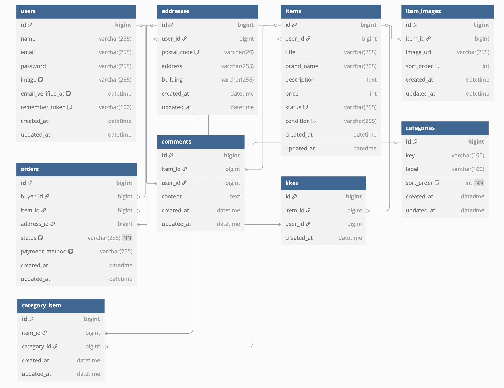

# アプリケーション名

フリマアプリ

-----


# セットアップ手順


-----

##  セットアップ

### 1\. リポジトリのクローン

まず、プロジェクトのリポジトリをローカルにクローンし、ディレクトリに移動します。

```bash
git clone git@github.com:matsuoka1985/fleamarket-app.git
cd fleamarket-app
```

### 2\. Dockerコンテナの起動


```bash
docker compose up -d --build
```

** 起動完了の確認:**
PHPコンテナがリクエストを受け付けられる状態になると、以下のコマンドの出力に `NOTICE: ready to handle connections` と表示されます。
この表示が出たら、アプリケーションの起動が完了し、ブラウザからアクセスできる状態です。この時点でcomposer installによるvendorディレクトリの作成、.envファイルの作成、APP_KEYの生成、マイグレーション、シーディングが完了しています。

```bash
docker compose logs -f php
```

-----

##  テスト


### 1\. PHPUnitテストの実行


```bash
php artisan test
```

### 2\. Laravel Duskテストの実行


```bash
php artisan dusk
```

-----

##  アクセス情報 & コンテナアクセス

全てのコンテナが起動し、アプリケーションのセットアップが完了すると、以下のURLで各サービスにアクセスできます。

  * **Laravel アプリケーション**: [http://localhost:80](http://localhost:80)
  * **MailHog (開発用メール UI)**: [http://localhost:8025](http://localhost:8025)
  * **phpMyAdmin (データベース管理GUIツール UI)**: [http://localhost:8080](http://localhost:8080)

### PHPコンテナへのアクセス

PHPコンテナのシェルに入るには、以下のコマンドを使用します。

```bash
docker compose exec php bash
```


#### Stripe APIキーの追記

`.env` ファイルにStripeのAPIキーを追記してください。キーは別途共有されます。

---

## 使用技術(実行環境)

* PHP 7.4.9
* Laravel 8.83.29
* MySQL 8.0.37
* nginx 1.21.1

---

## ER図




```mermaid
erDiagram
    users ||--o{ addresses : has
    users ||--o{ items : owns
    users ||--o{ orders : places
    users ||--o{ comments : writes
    users ||--o{ likes : gives

    items ||--o{ item_images : has
    items ||--o{ comments : receives
    items ||--o{ likes : receives
    items ||--o{ category_item : belongs_to
    items ||--o{ orders : included_in

    categories ||--o{ category_item : includes

    addresses ||--o{ orders : used_for

    orders ||--|| items : contains
    orders ||--|| users : by
    orders ||--|| addresses : ships_to

    comments ||--|| users : from
    comments ||--|| items : on

    likes ||--|| users : by
    likes ||--|| items : on

    category_item ||--|| categories : links
    category_item ||--|| items : links
